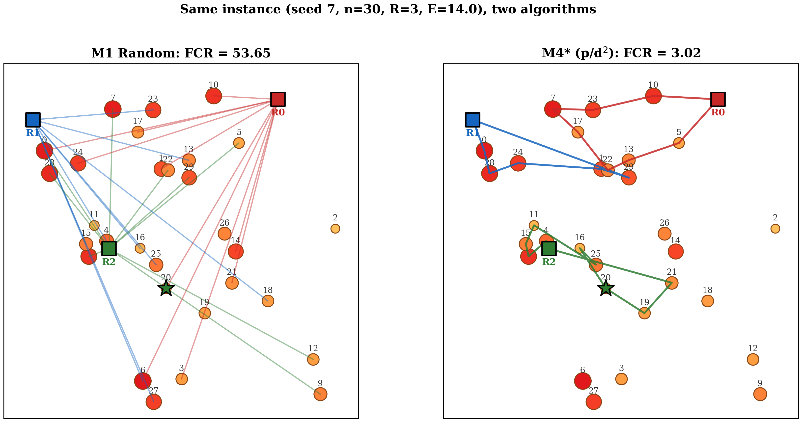

# SearchFCR

**A benchmark and reference implementation for budgeted multi-robot search with probability-aware auctions.**

SearchFCR packages the algorithms and experiments from the CSULB honors thesis *On the Numerical Analysis of Multi-Robot Search and Rescue Algorithms in Unknown Environments* (Babaeiyan Ghamsari, 2026) as a reusable Python library, a command-line tool, a reproducible benchmark suite, and an interactive web simulator. The thesis introduces a bid function `p/d²` that outperforms the classical `p/d` Stone-rule bid under finite energy constraints, with three supporting robustness experiments.

<p align="center">
  <br/>
  <em>Same instance, same seed. <strong>M1 (left)</strong> — robots pick sites independently and fly spaghetti. <strong>M4* (right)</strong> — auction-coordinated <code>p/d²</code> bidding, lower finder travel distance.</em>
</p>

## Why this exists

Multi-robot search-and-rescue has been studied from three angles — online competitive analysis (the cow-path problem), market-based auction coordination, and energy-constrained graph exploration — each in isolation. No prior work unifies all three into a single benchmark. SearchFCR fills that gap:

- **Five models** spanning the {energy × communication} design space (M1 random, M2 auction ∞E, M3 single-sortie, M4 chain p/d, M4* chain p/d²).
- **Multiple bid functions** (`p`, `1/d`, `p/d`, `p/d²`, `p·e^{−d/E}`) with a documented API for adding more.
- **Three cost models** (Euclidean, Manhattan, obstacle-penalty) plus heterogeneous-speed fleets.
- **Theoretical upper bounds** on finder competitive ratio for each model, empirically validated.
- **Interactive web simulator** — step through any model round-by-round, compare two models side-by-side, or run a full 5-model benchmark with ranked FCR bar chart.
- **Reproducible benchmarks** with fixed seeds so your numbers match ours bit-for-bit.

## Headline findings (thesis Table II, 5,000 trials)

| Model | Mean FCR | What it tells us |
|---|---:|---|
| M1 Random (∞ E) | 18.74 | Without coordination, FCR is a disaster. |
| M2 Auction (∞ E, N2N) | 2.83 | With unlimited battery, auctions are excellent. |
| H<sub>d</sub> Hungarian (E, dist-only) | 6.88 | Centralized, probability-blind. |
| H<sub>p/d</sub> Hungarian (E, p/d) | 7.38 | Probability-aware, centralized — worse than H<sub>d</sub>. |
| M3 Auction (E, p/d) | 6.32 | Probability-aware, distributed. Single sortie. |
| M4 Auction (E, chain, p/d) | 3.16 | Chain extension recovers 90% of the energy gap. |
| **M4\* Auction (E, chain, p/d²)** | **3.11** | **Quadratic distance penalty → 1.5% further improvement.** |

Key gaps: **6.6×** coordination gain (M1→M2); **90%** energy gap recovered (M3→M4*); **1.5%** bid function improvement (M4→M4*).

## Install

```bash
git clone https://github.com/foojanbabaeeian/Multi-Robot-Algo.git
cd Multi-Robot-Algo
pip install -e .
```

Requires Python ≥ 3.10, numpy, scipy, matplotlib.

## One-line reproduction

```bash
python reproduce_thesis.py          # all thesis figures (~3 min)
python reproduce_thesis.py --quick  # 100-trial fast check (~45 s)
```

## Interactive web simulator

The `sar-sim` React app lets you explore every model interactively. Start it with:

```bash
# Terminal 1 — backend
cd backend && uvicorn server:app --reload --port 8000

# Terminal 2 — frontend
cd sar-sim && npm install && npm run dev
```

Then open `http://localhost:5173`.

**Features:**
- **Single mode** — run any of the 5 models, step through rounds, watch robots move with animated paths.
- **Compare mode** — side-by-side view of two models on the same instance, synchronized playback, FCR winner callout.
- **Benchmark mode** — runs all 5 models in parallel on the same seed, displays a sorted FCR bar chart with color-coded rankings. This is the killer view for demos.
- **Entropy timeline** — visualizes Bayesian belief collapse round-by-round (Shannon entropy of the prior distribution).
- **FCR timeline** — per-round FCR history with ideal M2 baseline marked.
- **Shareable URLs** — all parameters are encoded in the query string (`?n=20&r=3&e=15&seed=42&model=M4*&mode=benchmark`).
- **Animation speed control** — 0.5×, 1×, 2×, 4× playback speed.
- **Keyboard shortcuts** — `←`/`→` navigate rounds, `Space` plays/pauses.
- **Hover tooltips** — hover any node to see its ID, current probability, distance from base, and visited status.

## CLI quickstart

```bash
# Generate an instance
searchfcr generate --n 30 --r 3 --L 10 --seed 42 -o instance.json

# Run one model
searchfcr run --instance instance.json --model M4star --energy 14 --bid p_over_d2

# Sweep the energy budget
searchfcr sweep --param energy --range 8,30 --step 2 --trials 500 \
                --models M3,M4,M4star --output energy_sweep.csv

# Run the default benchmark suite
searchfcr bench --suite default
```

## Library quickstart

```python
from searchfcr import Instance, run

instance = Instance.generate(n=30, r=3, L=10.0, seed=42)

for model in ["M1", "M2", "M3", "M4", "M4star"]:
    result = run(model, instance, energy=14.0, bid="p_over_d2")
    print(f"{model:6s}  FCR={result.fcr:5.2f}  found={result.found}  "
          f"iters={result.iterations}")
```

## The four contributions of the thesis

1. **The `p/d²` bid function** — under finite energy, the classical Stone-rule `p/d` bid over-commits to distant high-probability sites. The *cost-foreclosure argument* (thesis §3.3) shows the effective marginal cost of distance is superlinear, so the bid should penalize `d²`. Empirically: 1.5% FCR improvement at default settings, advantage widens at tight energy budgets. See `searchfcr/bids.py`.

2. **The Target-Delay Anomaly** — 2-opt post-processing shortens tours on average but *worsens* FCR by 5.3%, because it re-orders sites by geometric efficiency rather than probability-weighted reward. The standard robotics pipeline ("build a tour, polish with 2-opt") is actively harmful for finder-centric metrics under Bayesian priors. See `experiments/exp2_target_delay.py`.

3. **Prior-misspecification robustness** — the `p/d²` advantage over `p/d` widens as priors become noisy (σ=0: margin 0.13 FCR; σ=0.5: margin 0.49 FCR). See `experiments/exp1_prior_misspec.py`.

4. **Cost-model generalization** — `p/d²` wins under all four cost models tested (Euclidean, Manhattan, heterogeneous-speed fleet, obstacle-penalty). See `experiments/exp3_cost_sensitivity.py`.

## Repository layout

```
searchfcr/            # Stable public API
  instance.py         # Instance dataclass + JSON schema
  models.py           # run(), MODELS, RunResult
  bids.py             # Bid enum and bid functions
  metrics.py          # fcr(), entropy()
  bounds.py           # theoretical FCR upper bounds
  cli.py              # argparse CLI → `searchfcr` entry point

main.py               # Original monolithic research script (source of truth)

experiments/          # Three thesis-level extensions
  exp1_prior_misspec.py
  exp2_target_delay.py
  exp3_cost_sensitivity.py
  data/               # Raw CSV outputs (regenerated by reproduce_thesis.py)

thesis/               # LaTeX sources, figures, chapter prose
  Chapters/*.tex
  figures/

paper/                # IEEE conference-format version of the paper

pybullet_demo/        # 3D physics-based drone visualization (M1 vs M4*)
  run_demo.py         # Main entry point
  make_video.py       # Stitch frames into GIF (Pillow, no ffmpeg needed)
  frames/             # PNG frame output
  screenshots/        # Static reference screenshots

backend/              # FastAPI server (wraps main.py for the React UI)
  server.py           # POST /api/simulate, POST /api/step, GET /api/health

sar-sim/              # React 19 + TypeScript + Vite interactive simulator
  src/App.tsx         # Main app (Single / Compare / Benchmark modes)
  src/SimCanvas.tsx   # Canvas renderer with rAF animation loop
  src/types.ts        # Shared TypeScript types

tests/                # pytest suite
reproduce_thesis.py   # One-command full reproduction pipeline
```

## Running the PyBullet demo

```bash
# Requires: pip install pybullet matplotlib pillow
python pybullet_demo/run_demo.py --model M4star --seed 42

# Generate side-by-side comparison GIF (no ffmpeg needed)
python pybullet_demo/run_demo.py --model M1 --frames-only --out-dir pybullet_demo/frames/M1
python pybullet_demo/run_demo.py --model M4star --frames-only --out-dir pybullet_demo/frames/M4star
python pybullet_demo/make_video.py \
  --dir pybullet_demo/frames/M1 pybullet_demo/frames/M4star \
  --out compare.gif --side-by-side
```

## Contributing

If you write a new model or bid function that beats M4*'s FCR on the default benchmark suite, please open a pull request with:

1. The implementation in `searchfcr/models.py` or `searchfcr/bids.py`.
2. A test in `tests/`.
3. Benchmark numbers from `searchfcr bench --suite default --trials 500`.

We will update the headline table and add you as a co-author of the SearchFCR benchmark.

## Cite

```bibtex
@thesis{BabaeiyanGhamsari2026,
  author = {Babaeiyan Ghamsari, Fozhan},
  title  = {On the Numerical Analysis of Multi-Robot Search and Rescue
            Algorithms in Unknown Environments},
  school = {California State University, Long Beach},
  year   = {2026},
  type   = {Honors thesis},
  url    = {https://github.com/foojanbabaeeian/Multi-Robot-Algo}
}

@software{SearchFCR2026,
  author  = {Babaeiyan Ghamsari, Fozhan and Morales-Ponce, Oscar},
  title   = {{SearchFCR}: A Benchmark for Budgeted Multi-Robot Search
             with Probability-Aware Auctions},
  version = {0.1.0},
  year    = {2026},
  url     = {https://github.com/foojanbabaeeian/Multi-Robot-Algo}
}
```

## License

MIT. See `LICENSE`.
